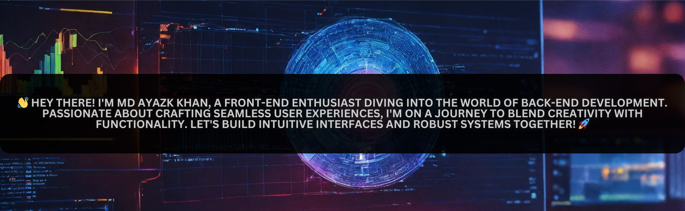

<h1>👋 Hey there, I am Ayaz, a forntend developer and now I am learning Backend,Database and Data Structures Algorithm </h1>

  

## 🛠️ Tech Stack

  
  
  
  
  
  
  
  
  
  

## 🚀 Projects

- [Project 0 - YouTube Clone](https://youtube-project-ayaz-khan.netlify.app/)
- [Project 0 - E-commerce](https://shoping-app-by-ayaz.netlify.app/)
- [Project 0 - Pomodoro clock](https://frg-25clock.netlify.app)
- [Project 0 - CALCULATOR](https://ayaz-khan-02024.github.io/calculator-by-ayaz/)
- [Project 0 - TODO-LIST-JAVASCRIPT](https://ayaz-khan-02024.github.io/todo/)
- [Project 0 - TODO-LIST-REACT](https://ayaz-khan-02024.github.io/React-Todo-by-Ayaz/)
- [Project 0 - PASSWORD-GENERATOR-JAVASCRIPT](https://ayaz-khan-02024.github.io/Password_Generator/)
- [Project 0 - MOVIE-APP-REACT](https://movie-m-star-by-ayaz.netlify.app/)

## 📫 Get in touch

- Email-id: [ayazkhan02024@gmail.com]
- LinkedIn: [www.linkedin.com/in/ayaz-khan-8750o]
- Portfolio: [https://ayaz-portfolio-2024.netlify.app/]

